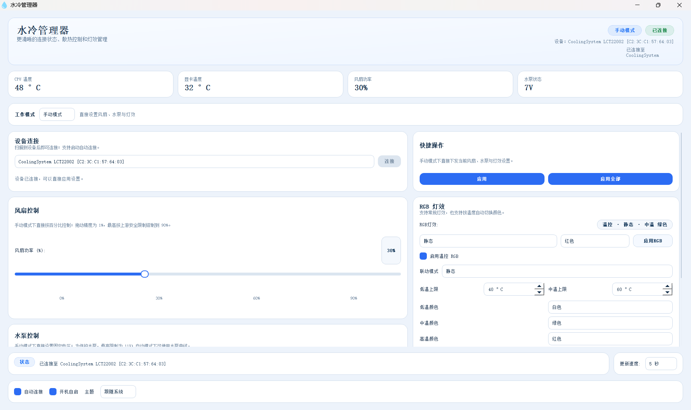
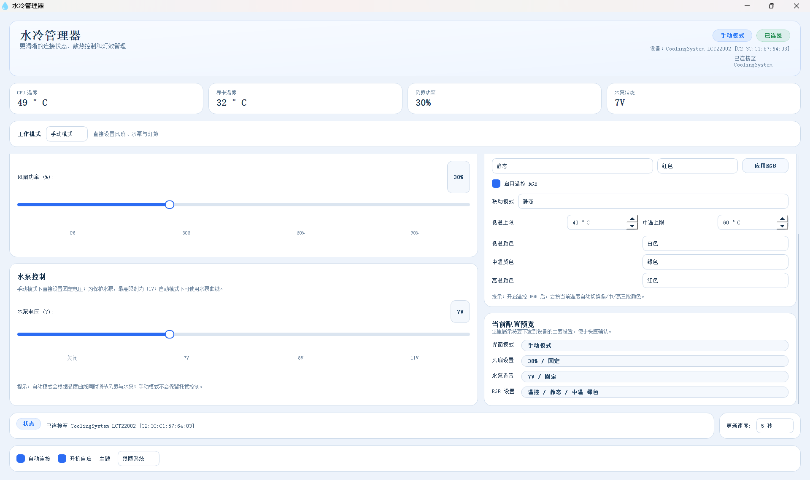
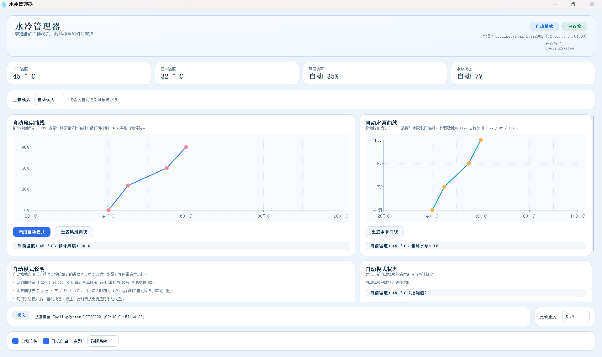
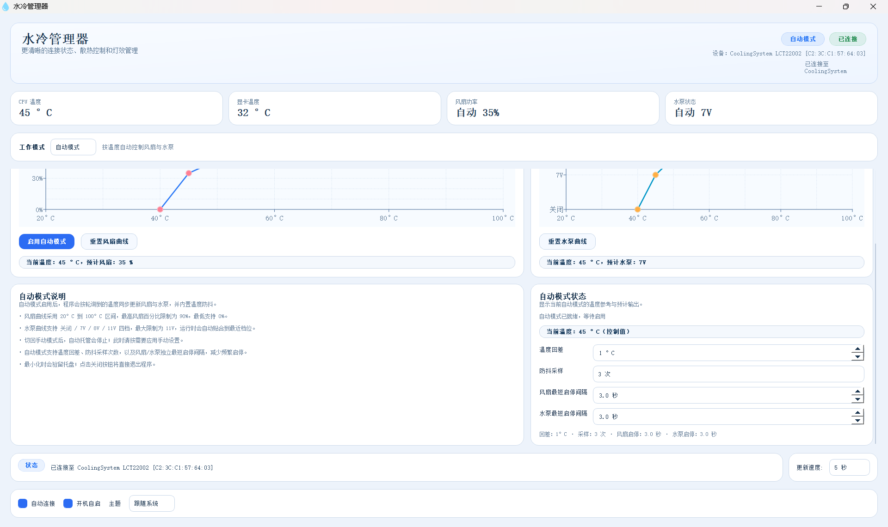

# Watercooler Manager Enhanced

一个用于 Windows 的水冷控制器图形化管理工具，可通过 BLE 连接兼容设备，并结合 CPU / GPU 温度实现风扇、水泵和 RGB 的手动或自动控制。

## 项目来源

本项目基于上游开源项目继续二次开发：

- `noteMASTER11/watercooler-manager`
- `tomups/watercooler-manager`

温度监控依赖：

- `LibreHardwareMonitor`

## 当前版本新增/改进（全部为AI操作）

- 中文界面与本地化调整
- 手动 / 自动双模式控制
- 风扇自动曲线支持多坐标点
- 水泵自动曲线支持多坐标点
- 风扇速度以百分比显示与调节
- 水泵最大电压限制为 11V
- RGB 灯效控制
- 温控 RGB 联动
- 深色 / 浅色 / 跟随系统主题
- 配置文件持久化
- 启动自动申请管理员权限
- 自动模式防抖
  - 温度回差
  - 中值采样过滤
  - 风扇最短启停间隔
  - 水泵最短启停间隔
- 首次启动默认参数优化
- 托盘与窗口行为优化

## 主要功能

- 通过 BLE 连接兼容的水冷控制器
- 手动设置风扇、水泵、RGB
- 根据温度自动调节风扇和水泵
- 根据温度区间自动切换 RGB 颜色
- 支持风扇/水泵自动曲线编辑
- 支持深色、浅色、跟随系统主题
- 支持配置自动保存和加载
- 








## 说明

- 本项目所有改进均为AI操作
- 测试环境：
版本	Windows 11 专业版
版本号	25H2
操作系统版本	26200.8037
体验	Windows 功能体验包 1000.26100.300.0
- 机械革命旷世Xpro2025款（14900/5070Ti）硬改水冷
- 机械革命冰河水冷机2025款 冷酷黑
- 风扇最高限制百分之90，保护风扇
- 水泵最高到11V，保护水泵

## 运行环境

- Windows 10 / 11
- Python 3.8+
- 蓝牙适配器可用
- 建议以管理员权限运行

## 安装依赖

```bash
pip install -r requirements.txt
```

常见依赖包括：

- `PyQt5`
- `qasync`
- `bleak`
- `pythonnet`

## 额外文件

请确保以下文件与程序一同提供：

- `LibreHardwareMonitorLib.dll`
- `icons/` 目录

## 运行

```bash
python watercooler_bt_gui.py
```

## 打包

### 直接使用 spec
```bash
pyinstaller watercooler_bt_gui.spec
```

### 或手动命令
```bash
pyinstaller --onefile --add-data "LibreHardwareMonitorLib.dll;." --add-data "icons;icons" --noconsole watercooler_bt_gui.py
```

## 配置文件

程序会在运行目录生成并读取配置文件：

- `watercooler.json`

配置文件用于保存：

- 控制模式
- 风扇参数
- 水泵参数
- RGB 参数
- 自动曲线
- 主题设置
- 更新频率
- 自动模式防抖参数

## 上传到 GitHub 前建议

- 仓库根目录保留 `LICENSE`
- 仓库根目录保留 `THIRD_PARTY_NOTICES.md`
- 发布二进制时，同时公开对应源码版本
- Release 里说明本版本相对上游的修改点
- 不要把上游 README 里的 MIT 表述原样带入你自己的仓库说明

## 第三方组件与致谢

感谢以下项目提供基础能力或参考：

- `tomups/watercooler-manager`
- `noteMASTER11/watercooler-manager`
- `LibreHardwareMonitor`

详细说明见：

- `THIRD_PARTY_NOTICES.md`

## License

当前按 **GPL-3.0** 方式公开发布本项目，并同时保留第三方说明文件。

详细说明见：

- `LICENSE`
- `THIRD_PARTY_NOTICES.md`
